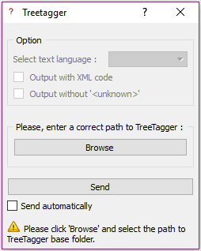
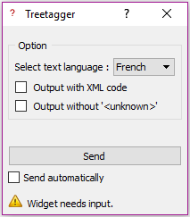

.. meta::
   :description: Orange Textable Prototypes documentation, TreeTagger 
                 widget
   :keywords: Orange, Textable, Prototypes, documentation, TreeTagger,
              widget

.. _TreeTagger:

TreeTagger_Widget
=================

Annote les textes entrant en type et lemma grâce à `Treetagger 
<http://www.cis.uni-muenchen.de/~schmid/tools/TreeTagger/>`_ .

Permet la lemmatisation et l'étiquetage morphosyntaxique d'un texte.

Auteur
------

Xavier Barros

Ce Widget à été créé dans le cadre du cours Projet en Informatique sous la supervision d'Aris Xanthos lors du semestre de printemps 2017 à l'UNIL (Université de Lausanne). 

Signals
-------

Inputs:

   Corpus texte (ex: Text Fiels, Text Files, etc...)

Outputs:

* ``Text data``

  Segmentation contenant le texte rentré annoté (type et lemma)

Déscription
-----------

Ce widget est conçu pour annoter un ou plusieurs textes dans Orange Canvas. 
Le widget fait appel à Treetagger afin d'annoter le contenu entrant.
Il renvoie une segmentation sous format texte ou xml contenant un segment par entrée.
Chaque segment a 3 annotations: un *id*, le *lemma* et le *type*.

L'interface de Treetagger Widget est disponible en deux versions.
La première apparait si le lien vers TreeTagger n'est pas rentré et bloque les fonctionnalités du widget.
La deuxième apparait lorsque le lien est rentré et permet une utilisation normale.

 
 
 

Lien vers Treetagger inconnu
~~~~~~~~~~~~~~~~~~~~~~~~~~~~

    
    Figure 1: **Treetagger** widget (interface verouillée).

Les **Options** sont vérouillées car le lien vers treetagger n'est pas rentré.

Les **Info** indiquent à l'utilisateur ce qu'il doit faire pour résoudre le problème.

Il faut aller chercher le lien vers le dossier Treetagger qui doit contenir un certain nombres de fichiers :

* ``cmd/tokenize.pl``
* ``cmd/utf8-tokenize.perl``
* ``bin/tree-tagger``

Le bouton **Send** envoie une segmentation à la sortie. 
Lorsque la checkbox **Send automaticaly** est sélectionnée,  
le bouton est désactivé et le widget tente d'émettre automatiquement une
sortie à chaque modification de son interface.

Lien vers Treetagger connu
~~~~~~~~~~~~~~~~~~~~~~~~~~

    
    Figure 2: **Treetagger** widget (interface déverouillée).

La section **Info** tout comme le bouton **Send** et **Send automatically** agissent de la même façon que dans l'interface avec Treetagger inconnu.

Les **Options** sont dévérouillées.

Cochez la checkbox **Output with XML code** et le résultat sera une sortie avec le texte annoter en XML. 
Cela est utile si votre texte à analyser contient du xml et que vous voulez garder sa structure. 

Cocher la checkbox **Output without '<unknow>'** pour ne pas avoir de lemma inconnu. 
Elle prendra la valeur du mot inconnu.

Les **langues** dans l'option apparaitront selon les langues qui seront dans le dossier dossier "Treetagger/lib".
Elles peuvent être télécharger sur le site de `Treetagger 
<http://www.cis.uni-muenchen.de/~schmid/tools/TreeTagger/>`_ même sous "Parameter files"
Le choix de la langue est affiché par ordre alphabétique.

.. figure:: figures/langue.png
    :align: center
    :alt: Advanced interface of the Text Tree widget

    Figure 3: **Option** du Widget Treetagger (interface déverouillée).

Voici une liste des fichier à avoir dans le document ``Treetagger/lib`` selon la langue désirée:

+ "French": "french.par", "french-abbreviations"
+ "English": "english-utf8.par", "english-abbreviations"
+ "German": "german-utf8.par", "german-abbreviations"
+ "Italian": "italian-utf8.par", "italian-abbreviations"
+ "Swahili": "swahili.par", "swahili-abbreviations"
+ "Portuguese" : "portuguese.par", "portuguese-abbreviations"
+ "Russian": "russian.par", "russian-abbreviations"
+ "Spanish": "spanish-utf8.par", "spanish-abbreviations", "spanish-mwls"
+ "Slovenian": "slovenian-utf8.par"
+ "Slovak": "slovak2-utf8.par"
+ "Romanian": "romanian.par"
+ "Polish": "polish-utf8.par"
+ "Mongolian": "mongolian.par"
+ "Latin": "latin.par"
+ "Galician": "galician.par"
+ "Finnish": "finnish-utf8.par"
+ "Estonian": "estonian.par"
+ "Bulgarian": "bulgarian-utf8.par"
+ "Spoken French": "spoken-french.par", "french-abbreviations

Messages
--------

Information
~~~~~~~~~~~

*Data correcly sent to output.*
    This confirms that the widget has operated properly.

Warnings
~~~~~~~~

*Settings were changed, please click 'Send' when ready.*
    Settings have changed but the **Send automatically** checkbox
    has not been selected, so the user is prompted to click the **Send**
    button (or equivalently check the box) in order for computation and data
    emission to proceed.
    
*Widget need input.*
    The widget instance is not able to emit data to output because the is no input.

*Treetagger is running...*
   Le widget est en train de tourner, il faut attendre.
   
*Please click 'Browse' and select the path to TreeTagger base folder.*
   Si le lien vers le dossier Treetagger n'est pas rentré.
   
*TreeTagger's link is correct ! Now, Widget needs input.*
   Quand le bon lien est rentré mais qu'il faut encore un input.
    
Errors
~~~~~~

*Sorry, TreeTagger's link isn't correct.*
    Si le lien vers le dossier Treetagger est faux.
    
*Sorry, TreeTagger's link not found.*
    Si le lien vers le dossier Treetagger n'est pas trouvé.
 

Connaissances
-------------

Ce cour m'a permis de développer mes connaissances:

+ Sur l'utilisation de Github
+ En python 2.7
+ Sur l'utilisation de l'invite de commande

J'ai appris à:

+ Identifier les problèmes potentiels
+ Débugguer un script 
+ Trouver l'endroit du problème
+ Aller chercher des solutions sur Internet
+ Améliorer les performances d'un code
+ Commanter un code
+ Faire un mise en page dans les normes imprimables
+ Utiliser un mac

Historique
----------

Au départ, le projet avait été imaginé lors du cour de Bachelors **Programmation pour le texte II**.
Nous étions 5 à travailler dessus dont 3 sur la partie codage.
Nous avons fait un `propotype <https://github.com/xbarros/Treetagger_for_Textable>`_ très limité qui ne fonctionnait pas très bien.

En majorité, je m'étais occupé de la partie informatique et c'est là que j'ai pris goût à la programmation.
J'ai donc décidé de recommencer le widget dans le cadre de mon Master.
Comme nous avions rencontré plusieurs problèmes, j'ai décidé de recommencer le widget à zéro.
J'ai fait attention à ne pas répéter les erreurs de l'année dernière ce qui m'a permis de gagner beaucoup de temps.

J'ai ajouté des Options au widget, amélioré le traitement de texte par Treetagger, refait légèrement différemment l'interface et ai permis une utilisation sur PC et Mac.
La manière de vérifier les dossiers Treetagger est aussi différente.

Problèmes rencontrés
--------------------

J'ai rencontré plusieurs problèmes lors du codage du widget.

Tout d'abord, la partie PC à Mac m'a pris beaucoup de temps. 
Je n'avais pas l'habitude de travailler avec ce type d'ordinateur.
La manière de reconnaitre des fichiers sur Mac n'est pas la même que sur PC.
J'ai donc du adapter le code selon le type de machine propre à l'utilisateur.

Puis, il a été imaginé de traiter des textes en format XML.
Cela posait problème avec la manière d'envoyer le texte vers Treetagger pour qu'il soit annoté.
J'ai du coder une nouvelle manière de faire rentrer les segments à annoter.
Manière qui, au final, n'a pas été utile.
Avec l'amélioration de la performance (point suivant) je n'ai pas eu besoin de différencier un text en xml d'un code normal.

Pour finir, lorsque le widget prennait enfin sa forme finale, plusieurs problèmes de performances ont été pointés du doigt.
Il n'a pas été facile de les corriger car cela voulait dire qu'il fallait changer plus de 100 lignes de codes.
Ces changements ont entrainé de nouveaux problèmes et ont retardé la finalisation de mon projet.

Problèmes restants
------------------

+ "xb_tt" apparait parfois dans le display.
+ Faire la version Python 3
